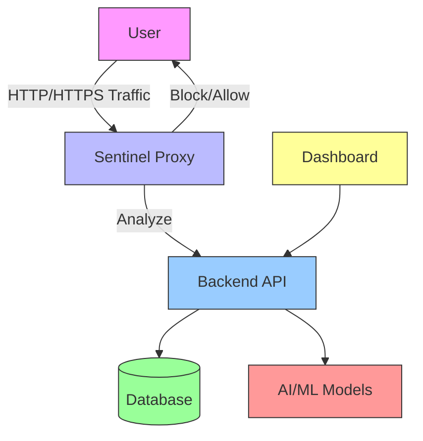

# 🏗️ System Architecture

## High-Level Overview

## Core Components

### 1. Sentinel Proxy
- **Purpose**: Intercepts and analyzes web traffic
- **Tech Stack**: Python, mitmproxy
- **Key Features**:
  - Real-time traffic inspection
  - Request/response modification
  - Local caching for performance
  - Blacklist management

### 2. Backend Service
- **Purpose**: Processes analysis requests and manages data
- **Tech Stack**: Java 17, Spring Boot, PostgreSQL
- **Key Features**:
  - RESTful API endpoints
  - Authentication & Authorization
  - Data persistence
  - Integration with AI/ML models

### 3. Frontend Dashboard
- **Purpose**: User interface for monitoring and control
- **Tech Stack**: React, Next.js, TailwindCSS
- **Key Features**:
  - Real-time monitoring
  - Threat visualization
  - Configuration management
  - User management

### 4. Database
- **Purpose**: Persistent data storage
- **Tech Stack**: PostgreSQL
- **Stores**:
  - User data
  - Threat intelligence
  - Analysis history
  - System logs

## Data Flow

1. **Request Interception**
   - Proxy captures HTTP/HTTPS requests
   - Extracts URL and metadata
   
2. **Analysis**
   - Sends request data to Backend API
   - AI/ML models evaluate threat level
   - Checks against blacklist/whitelist
   
3. **Action**
   - Blocks malicious requests
   - Logs analysis results
   - Updates dashboard in real-time

## Scalability

- **Horizontal Scaling**: Stateless services can be scaled independently
- **Load Balancing**: Proxy and API layers support load balancing
- **Caching**: Redis for session management and response caching
- **Asynchronous Processing**: Non-blocking I/O for better throughput

## Security Measures

- End-to-end encryption (HTTPS)
- JWT-based authentication
- Rate limiting
- Input validation
- Regular security audits
